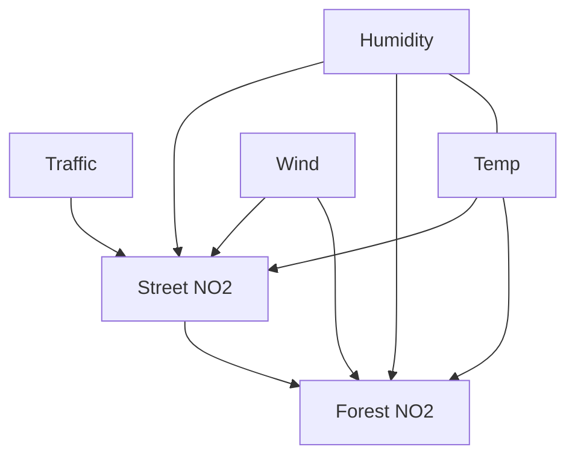
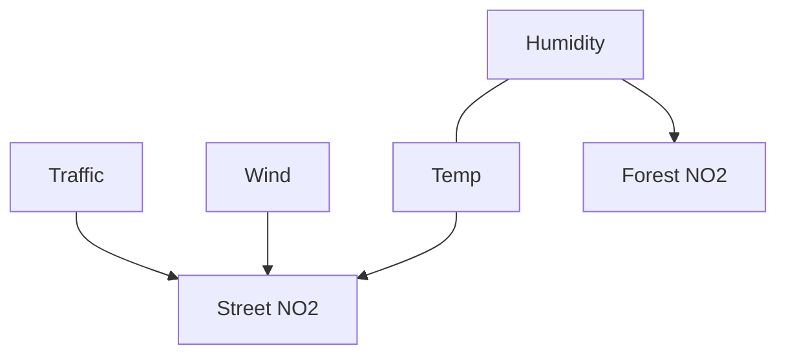

# fAirQ

Hourly **NO₂, PM10, and PM2.5** forecasts for Berlin, seven days ahead.

Stack: Python, LightGBM, ClickHouse, Docker, Kubernetes jobs, FastAPI.

## Local pipeline

```bash
docker compose up --build -d
docker compose run --rm api python -m fairq.ingest
docker compose run --rm api python -m fairq.train
docker compose run --rm api python -m fairq.validate
docker compose run --rm api python -m fairq.score
docker compose run --rm api python -m fairq.monitor
docker compose run --rm api python -m fairq.cdmi
curl http://localhost:8000/health
curl http://localhost:8000/ready
curl http://localhost:8000/status
curl "http://localhost:8000/forecast?station_id=mc174&pollutant=NO2"
curl http://localhost:8000/graph
open http://localhost:8000/graph/view
docker compose run --rm api python -m fairq.plot_graph
curl "http://localhost:8000/simulate?traffic_scale=0.8"
```

Ingest pulls **12 months** of hourly **NO₂, PM10, PM2.5** from three Berlin stations plus DWD weather. Train fits a 1h model and direct 24h / 96h / 168h models (last 14 days held out) and records skill vs persist. Validate checks row counts, last-window skill, and a **second 14-day holdout**. Score writes a 7-day hourly forecast. Monitor fails if measurements or forecasts are stale.

`GET /health` is process liveness. `GET /ready` needs ClickHouse plus measurements and forecasts. `GET /status` returns the latest model metrics and `pipeline_runs`.

`python -m fairq.cdmi` is a **light CDMI** (same idea as the DeepAR+knockoff paper, not that codebase): six hourly series, a small LSTM DeepAR-style forecaster (Gaussian NLL), then three knockoffs of each cause — **mean + small noise**, **uniform on the observed range**, and second-order **Gaussian** (comparison only). KS compares the **full residual CDFs** (mean, variance, and shape), not the mean alone; `ks_shape` is KS after stripping mean and variance. An edge is kept if mean+noise raises test MAE, uniform agrees, and the arrow is physically allowed (no NO₂ → weather, no traffic → weather, weather-internal only temp ↔ humidity). `GET /graph` returns the weighted graph. `GET /simulate?traffic_scale=0.8` is `do(traffic := 0.8 × traffic)` on street NO₂. `traffic` is a calendar proxy, not vehicle counts.

**Expected** (physics / domain):



**Learned** (light CDMI, 6 of 30 arrows). Compatible with the expected street-side skeleton. Not a Pearl DAG and not an effect estimate — parent screening plus those physics bans. Strongest keep is humidity ↔ temp. Gaps vs expected: no street → forest, and almost no weather → forest except humidity.



Weather (wind, mixing / inversions, humidity) should move both NO₂ sites. Traffic should hit the street canyon first. Street NO₂ can then spill to the forest / background site. Temp and humidity are coupled meteorology, not an intervention. Arrows that should **not** appear: NO₂ → weather, NO₂ → traffic, traffic → temp.

## Kubernetes (minikube)

A one-node cluster on this machine. Compose can stay up; use port **18000** for the cluster API so it does not clash with `localhost:8000`.

```bash
minikube start --driver=docker --memory=4096 --cpus=2
docker build -t fairq:latest .
minikube image load fairq:latest
kubectl apply -f k8s/
kubectl -n fairq get pods,cronjobs
kubectl -n fairq port-forward deploy/fairq-api 18000:8000
curl http://127.0.0.1:18000/health
```

`/ready` stays 503 until ingest+score have filled the **in-cluster** ClickHouse (empty on first boot; not the Compose database). CronJobs: ingest hourly, train+validate daily at 03:00 UTC, score hourly, monitor every 15 minutes.

```bash
minikube stop    # keep the cluster, free Docker RAM
minikube delete  # wipe it
```

## Tests

```bash
pip install -r requirements.txt -r requirements-dev.txt
PYTHONPATH=src pytest -q
```

## Layout

```
src/fairq/api.py       FastAPI
src/fairq/ingest.py    BLUME + weather download
src/fairq/features.py  lags + weather join
src/fairq/train.py     LightGBM
src/fairq/validate.py  data contracts + second holdout
src/fairq/score.py     7-day forecast
src/fairq/monitor.py   freshness checks
src/fairq/cdmi.py      light causal graph + simulate
src/fairq/db.py        ClickHouse client
k8s/                   API Deployment + CronJobs
```
